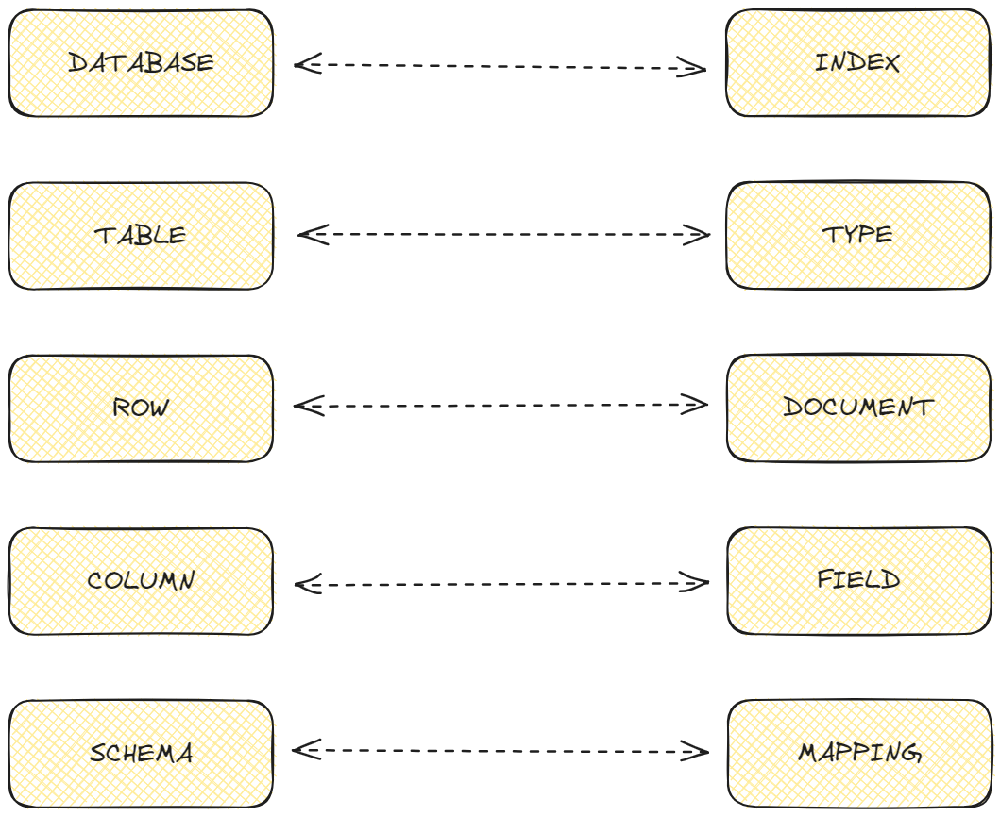

# Elasticsearch

Elasticsearch, Java programlama dili ile oluşturulmuş bir metin arama motorudur. Metin arama motorları son dönemlerde ortaya çıkmış **"Big Data"** kavramı sonucu oluşan karmaşık ve çok fazla verinin işlenmesi konusundaki problemlere karşı geliştirilmiş bir çözümdür.

## Elasticsearch Nedir ?

- Elasticsearch, dağınık bir halde bulunan verileri yapılandırarak arama ve işleme imkanı sağlar.
- Günümüzde her an milyonlarca satır veri üretilmektedir. Bu verilerin işlenmesi veritabanı düzeyinde gerçekleşiyorsa bunun sonucunda hız konusuna oldukça geride kalırız. Elasticsearch içinde yer alan algoritmalar sayesinde bu verilerin işlenmesi oldukça hızlı gerçekleşir.

## Elasticsearch İçerisinde Yer Alan Kavramlar



- SQL'de yer alan **database** kavramı ES'de **index** olarak geçer.
- SQL'de yer alan **table** kavramı ES'de **type** olarak geçer.
- SQL'de yer alan **row** kavramı ES'de **document** olarak geçer.
- SQL'de yer alan **column** kavramı ES'de **field** olarak geçer.
- SQL'de yer alan **schema** kavramı ES'de **mapping** olarak geçer.
- Küme(cluster), birden çok düğümden oluşan tüm verilerimizi bir arada tutan, düğümlerde arama yetenekleri sağlayan bir yapıdır.
- Düğüm(node), verilerimizi depolayan birimdir.
- Alias, index'e bir referansdır.
- Bulk, belge ekleme (indexing), güncelleme (update), silme (delete) gibi işlemleri birden fazla belge üzerinde tek seferde yapmak için kullanılır.

## Elasticsearch Avantajları

- Büyük verilerin anlamlı ve işlenebilir hale gelmesini sağlar.
- Açık kaynak kodlu bir yazılım olduğundan herkes tarafından kolayca kullanılabilir.
- ES'nin avantajlarından biri veri yüklendiği gibi anında arama sonuçlarına eklenmesidir. Bu sayede müşterilerin/şirketlerin bu verileri anında işleyerek, analiz yapmalarını kolaylaştırır.
- ES'de aranan veriler depolanmaktadır. Bu sayede verilerin tekrar aranmasına gerek kalmadan bulunmasına ve kullanılmasına olanak sağlar.
- Eksik bir şekilde aratılan verileri, otomatik bir şekilde tamamlayarak, daha iyi, doğru ve güvenilir sonuçlar elde edilmesi sağlanır.

## Elasticsearch Kurulumu

Öncelikle elasticsearch' docker üzerinden kurup ayağa kaldırıcaz.

- Öncelikle elasticsearch image'ini docker hub'dan çekmemiz gerekiyor. Aşağıdaki komut ile bunu gerçekleştirebiliriz.

```docker
docker pull docker.elastic.co/elasticsearch/elasticsearch:7.6.2
```

- Sonra indirdiğimiz image'i kullanarak bir container oluşturup elasticsearch'ü ayağa kaldırmalıyız.

```docker
docker run -p 9200:9200 -p 9300:9300 -e "discovery.type=single-node" docker.elastic.co/elasticsearch/elasticsearch:7.6.2
```

Spring Boot uygulamamızda elasticsearch'ü kullanabilmemiz için aşağıdaki dependency'i projemize eklememiz gerekiyor.

```xml
<dependency>
    <groupId>org.springframework.boot</groupId>
    <artifactId>spring-boot-starter-data-elasticsearch</artifactId>
</dependency>
```
